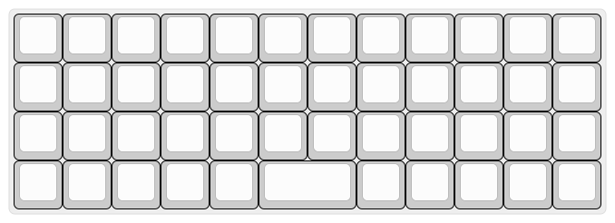

# (Mostly) The Default Planck Layout

The biggest change from the default Planck layout is that Return has been moved
to the Raise/Lower layers, and in its place is a Right-Shift.

%0A0%0A%0A%0A%0A%0A%0A%0AP&=%0A%0A%0ADel%0A%0A%0A%0A%0A%0ABackSp%3B&@=%0ADel%0ADel%0A%0A%0A%0A%0A%0A%0AEsc&=%0AF1%0AF1%0A%0A%0A%0A%0A%0A%0AA&=%0AF2%0AF2%0A%0A%0A%0A%0A%0A%0AS&=%0AF3%0AF3%0AAud+%0A%0A%0A%0A%0A%0AD&=%0AF4%0AF4%0AAud-%0A%0A%0A%0A%0A%0AF&=%0AF5%0AF5%0AMac%0A%0A%0A%0A%0A%0AG&=%0AF6%0AF6%0AWin%0A%0A%0A%0A%0A%0AH&=%0A%2F_%0A-%0AQWE%0A%0A%0A%0A%0A%0AJ&=%0A+%0A%2F=%0ACLMK%0A%0A%0A%0A%0A%0AK&=%0A%7B%0A%5B%0ADVRK%0A%0A%0A%0A%0A%0AL&=%0A%7D%0A%5D%0APLVR%0A%0A%0A%0A%0A%0A%2F%3B&=%0A%7C%0A%5C%0A%0A%0A%0A%0A%0A%0A'%3B&@_a:7%3B&=Shift&_a:4%3B&=%0AF7%0AF7%0AVce-%0A%0A%0A%0A%0A%0AZ&=%0AF8%0AF8%0AVce+%0A%0A%0A%0A%0A%0AX&_f:1%3B&=%0AF9%0AF9%0AMsc+%0A%0A%0A%0A%0A%0AC&=%0AF10%0AF10%0AMsc-%0A%0A%0A%0A%0A%0AV&=%0AF11%0AF11%0AMIDI+%0A%0A%0A%0A%0A%0AB&=%0AF12%0AF12%0AMIDI-%0A%0A%0A%0A%0A%0AN&=%0AS+NUSH%0ANUSH%0A%0A%0A%0A%0A%0A%0AM&=%0AS+NUBS%0ANUBS%0A%0A%0A%0A%0A%0A%0A,&_f:2%3B&=%0AHome%0APg%20Up%0A%0A%0A%0A%0A%0A%0A.&=%0AEnd%0APg%20Dn%0A%0A%0A%0A%0A%0A%0A%2F%2F&=%0AReturn%0AReturn%0A%0A%0A%0A%0A%0A%0AShift%3B&@_a:7%3B&=&=Ctrl&=Alt&=OS&=%2F&dArr%2F%3B&_a:4&w:2%3B&=%0ASpace%0ASpace%0ASpace%0A%0A%0A%0A%0A%0ASpace&_a:7%3B&=%2F&uArr%2F%3B&_a:4%3B&=%0ANext%0ANext%0A%0A%0A%0A%0A%0A%0A%2F&larr%2F%3B&=%0AVol%20-%0AVol%20-%0A%0A%0A%0A%0A%0A%0A%2F&darr%2F%3B&=%0AVol%20+%0AVol%20+%0A%0A%0A%0A%0A%0A%0A%2F&uarr%2F%3B&=%0APlay%0APlay%0A%0A%0A%0A%0A%0A%0A%2F&rarr%2F)
